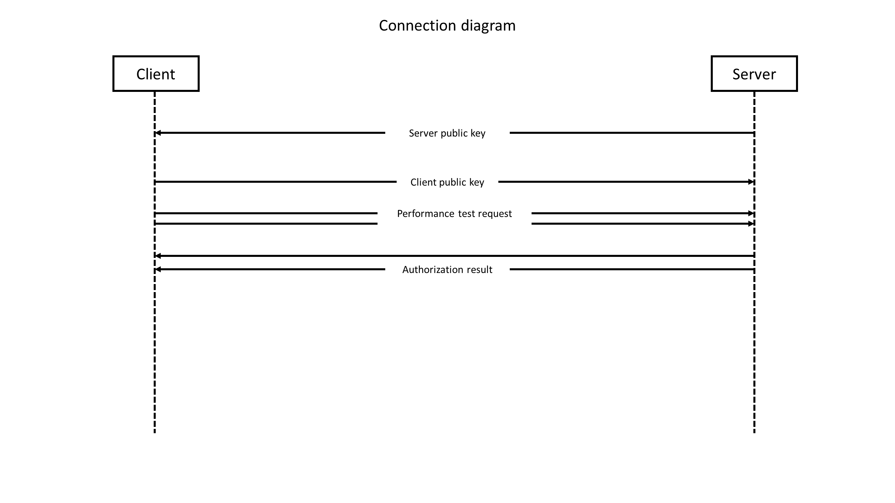
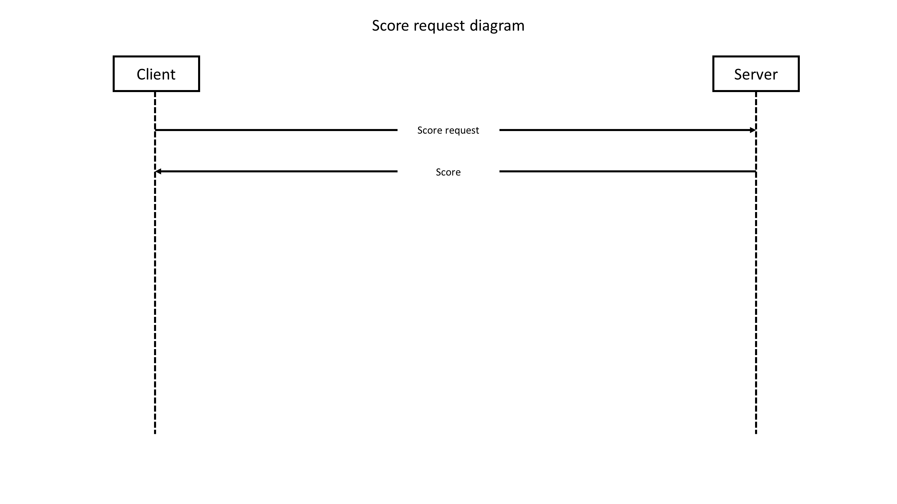
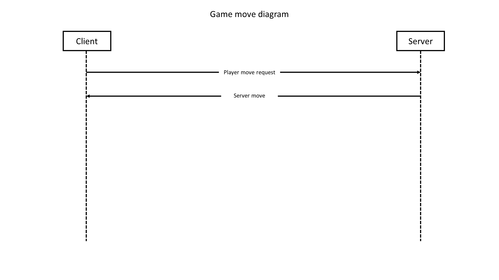
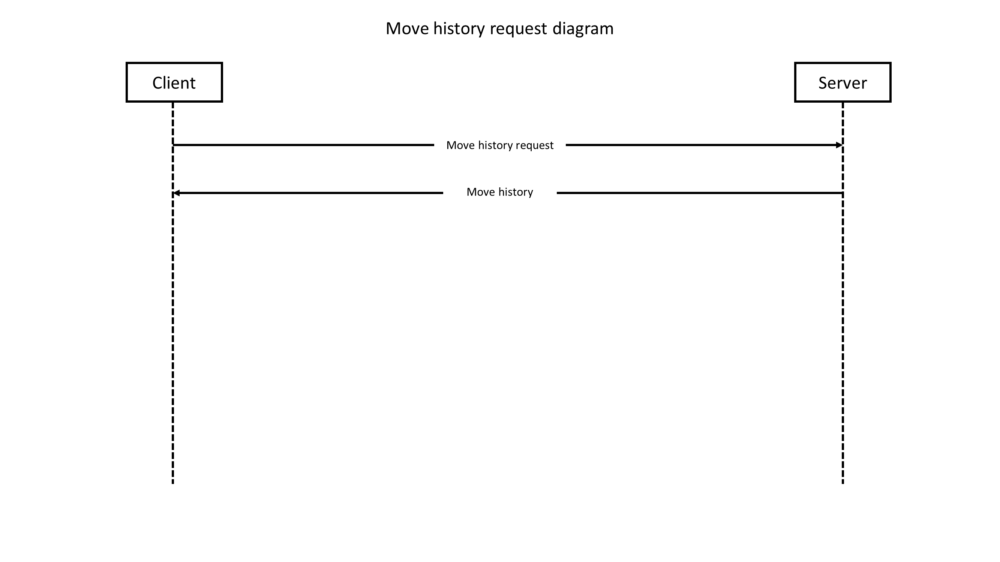
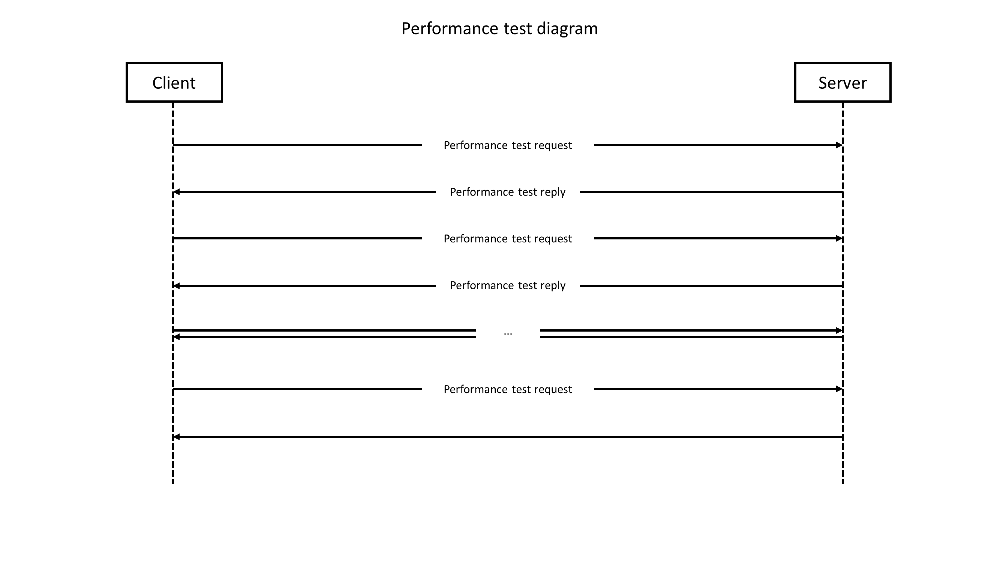

# Project description

Enter the world of RPS: Rock/Paper/Scissors, a massively multiplayer online RPG 
where every duel is destiny.

Step into a persistent client-server battlefield where ancient forces clash in 
an eternal cycle of dominance. Become the unbreakable Rock, standing firm against 
chaos and time itself. Embrace the razor-edged Scissors, swift, unpredictable, 
and dangerously precise. Or master the cunning Paper, outwitting foes with endless 
adaptability and deceptive control.

In a realm where every encounter is a mind game and every victory reshapes your 
legend, strategy is power—and prediction is survival. No luck. No mercy. Just pure, 
elemental conflict reborn as an epic MMO experience.

# Building

## Windows
To build RPS on Windows, make sure you have [git](https://git-scm.com/), 
[cmake](https://cmake.org/) and [vcpkg](https://vcpkg.io/en/) installed.

Install OpenSSL and Sqlite3 packages using vcpkg.

Run the following commands:
```
git clone https://github.com/Smok1e/RPS
git submodule update
mkdir build && cd build
cmake .. -DCMAKE_TOOLCHAIN_FILE=<path/to/vcpkg>/scripts/buildsystems/vcpkg.cmake
cmake --build .
```

## Unix
To build RPS on unix, make sure you have git, cmake, OpenSSL and Sqlite3 installed,
then run the following commands:
```
git clone https://github.com/Smok1e/RPS
git submodule update
mkdir build && cd build
cmake ..
cmake --build .
```

# Technical details

## Configuration

Project configuration is stored in `include/common/config.hpp` file. 

By default, the project uses the following config values:
-	`1337` as the server port
-	`127.0.0.1` as the default server address
-	`AES-256-CTR` as the network cipher,
-	`SHA2-256` as the password digest algorithm
-	`score.db` as the database location
-	`5 seconds` for the performance test duration

## Data type representations used in the protocol

The following table describes various predefined data types used later in the
protocol documentation:

| Name    | Size in bytes | Description					                                    
|---------|---------------|-----------------------------------------------------------------
| uint8   | 1             | Single byte number                                              
| uint16  | 2             | Two-byte little-endian number                                   
| uint32  | 4             | Four-byte little-endian number                                  
| string  | 2 + [length]  | A string. Consists of uint16 length and uint8[length] data bytes. 
| boolean | 1             | A boolean value. Any value other than 0 is treaded as true      

## Binary packet protocol

The protocol is built over TCP and uses binary message packets to send requests and replies.
Every message packet should follow this structure:

| Field name | Field type      | Description		                      |
|------------|-----------------|------------------------------------------|
| size       | uint16          | Total packet size without the size field |
| message_id | uint8           | The type of the message                  |
| payload    | uint8[size - 1] | Message payload                          |

## Emunerations

### MessageID

The following table describes the MessageID enumeration:

| Name						 | Value | Description
|----------------------------|-------|----------------------------------------------------- 
| DebugMessage               | 0x00  | Debug message (sent by client/server)
| Error                      | 0x01  | Error message (sent by client/server)
| KeyExchangeInit            | 0x02  | x25519 key exchange init (sent only by server)
| KeyExchangeReply           | 0x03  | x25519 key exchange reply (sent only by client)
| PlayerAuthorizationRequest | 0x04  | Player authorization request (sent only by client)
| PlayerAuthorizationReply   | 0x05  | Player authorization reply (sent only by server)
| PlayerScoreRequest         | 0x06  | Player score request (sent only by client)
| PlayerScoreReply           | 0x07  | Player score reply (sent only by server)
| PlayerMoveRequest          | 0x08  | Player move request (sent only by client)
| PlayerMoveReply            | 0x09  | Player move reply (sent only by server)
| MoveHistoryRequest         | 0x0A  | Move history request (sent only by client)
| MoveHistoryReply           | 0x0B  | Move history reply (sent only by server)
| PerformanceTestRequest     | 0x0C  | Performance test request (sent only by client)
| PerformanceTestReply       | 0x0D  | Performance test reply (sent only by server)

### GameMove

The following table describes the GameMove enumeration:

| Name	   | Value | Description
|----------|-------|---------------
| Rock     | 0x00  | Rock move
| Paper    | 0x01  | Paper move
| Scissors | 0x02  | Scissors move

### GameResult

The following table describes the GameMove enumeration:

| Name	 | Value | Description
|--------|-------|---------------
| Win    | 0x00  | The player beats the opponent
| Defeat | 0x01  | The player is defeated by the opponent
| Draw   | 0x02  | The player and the opponent choices are the same

# Messages payload structure

### DebugMessage

The DebugMessage (id 0x00) is sent by any side to send a debug message.

Message payload:

| Field name | Field type | Description
|------------|------------|--------------
| message    | string     | Message text

### Error message

The Error message (id 0x01) is sent by any side to send a protocol error
description before forcefully closing the connection.

Message payload:

| Field name | Field type | Description
|------------|------------|--------------
| message    | string     | Error description

### KeyExchangeInit message

The KeyExchangeInit message (id 0x02) is sent by the server side to initiate
a key exchange process.

Message payload:

| Field name | Field type | Description
|------------|------------|--------------
| public_key | uint8[32]  | The server public key

### KeyExchangeReply message

The KeyExchangeInit message (id 0x03) is sent by the client side
as a response to KeyExchangeInit message.

Message payload:

| Field name | Field type | Description
|------------|------------|--------------
| public_key | uint8[32]  | The client public key

### PlayerAuthorizationRequest message

The PlayerAuthorizationRequest message (id 0x04) is sent by the client side
to initiate player authorization process.

Message payload:

| Field name | Field type | Description
|------------|------------|--------------
| username   | string     | Player username
| password   | string     | Player password
| register   | boolean    | Should new player be registered

### PlayerAuthorizationReply message

The PlayerAuthorizationReply message (id 0x05) is sent by the server side
as a response to a PlayerAuthorizationRequest message.

Message payload:

| Field name | Field type | Description
|------------|------------|--------------
| success    | boolean    | Authorization/registration success
| reason     | string     | Authorization/registration failure reason

### PlayerScoreRequest message

The PlayerScoreRequest message (id 0x06) is sent by the client side
to request player score to be sent by the server side.

_This type of message does not have any payload_

### PlayerScoreReply message

The PlayerScoreReply message (id 0x07) is sent by the server side
as a response to a PlayerScoreRequest message.

Message payload:
			     
| Field name     | Field type | Description
|----------------|------------|--------------
| global_wins    | uint16     | Player win count across all game sessions
| global_defeats | uint16     | Player defeat count across all game sessions
| global_draws   | uint16     | Player  count across all game sessions
| curr_wins      | uint16     | Player win count across current game session
| curr_defeats   | uint16     | Player defeat count across current game session
| curr_draws     | uint16     | Player  count across current game session

### PlayerMoveRequest message

The PlayerMoveRequest message (id 0x08) is sent by the client side
to request server to perform a game with the player.

Message payload:
			     
| Field name     | Field type | Description
|----------------|------------|--------------
| player_move    | uint8      | Player move enumeration value

### PlayerMoveReply message

The PlayerMoveReply message (id 0x09) is sent by the server side
as a response to a PlayerMoveRequest message.

Message payload:
			     
| Field name     | Field type | Description
|----------------|------------|--------------
| player_move    | uint8      | The player move enumeration value
| server_move    | uint8      | The server move enumeration value
| game_result    | uint8      | Game result enumeration value

### MoveHistoryRequest message

The MoveHistoryRequest message (id 0x0A) is sent by the client side
to request server to send current game session move history.

_This type of message does not have any payload_

### MoveHistoryReply message

The PlayerMoveReply message (id 0x0B) is sent by the server side
as a response to a MoveHistoryReply message.

Message payload:
			     
| Field name     | Field type                 | Description
|----------------|----------------------------|--------------
| game_count     | uint16                     | The number of games performed in the session
| history        | (uint8, uint8)[game_count] | A sequence of pairs of player and server moves

### PerformanceTestRequest message

The PerformanceTestRequest message (id 0x0C) is sent by the client side
to initiate a protocol performance test.

Message payload:
			     
| Field name     | Field type       | Description
|----------------|------------------|--------------
| data_size      | uint16           | The data vector size
| data           | uint8[data_size] | The data vector

### PerformanceTestReply message

The PerformanceTestReply message (id 0x0D) is sent by the server side
to reply to a protocol PerformanceTestRequest message.

Message payload:
			     
| Field name     | Field type       | Description
|----------------|------------------|--------------
| data_size      | uint16           | The data vector size
| data           | uint8[data_size] | The data vector

## Connection procedure
-	Client connects to the server over the TCP
-	Server generates x25519 keypair and sends its public key using KeyExchangeInit message.
-	Client generates x25519 keypair and receives server public key with the KeyExchangeInit message.
-	Client derives a shared secret sends its public key using KeyExchangeReply message.
-	Server receives client public key and derives a shared secret.
-	All further data is encrypted using AES-256-CTR algorithm.
-	The user inputs its username and password, which is send by client with a PlayerAuthorizationRequest message.
-	The server responds with the PlayerAuthorizationReply message.
-	In case of failure, the client will prompt user again for the credentials and authorization steps.
	


## Score request procedure
-	The user inputs "score" command
-	Client asks server to send player score by sending PlayerScoreRequest message
-	The server responds with PlayerScoreReply message, containing player
	global and sesson score.
-	Client outputs the score to the user's terminal



## Game move procedure
-	The user inputs the "rock", "paper" or "scissors" command
-	Client sends PlayerMoveRequest message with the corresponding option
-	Server generates random move and responds with the PlayerMoveReply message
-	Client outputs game result to the user's terminal



## Move history request procedure
-	The user inputs the "history" command
-	Client sends MoveHistoryRequest message
-	Server responds with the MoveHistoryReply message, containing player move history
-	Client outputs game history to the user's terminal



## Performance test procedure

-	The usert inputs the "perf" command
-	Client sends PerformanceTestRequest message, containing random data
-	Server responds with the PerformanceTestReply, containing the same random data
-	Client validates the returned data and repeats last stepts until test duration is exceeded

